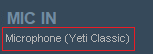
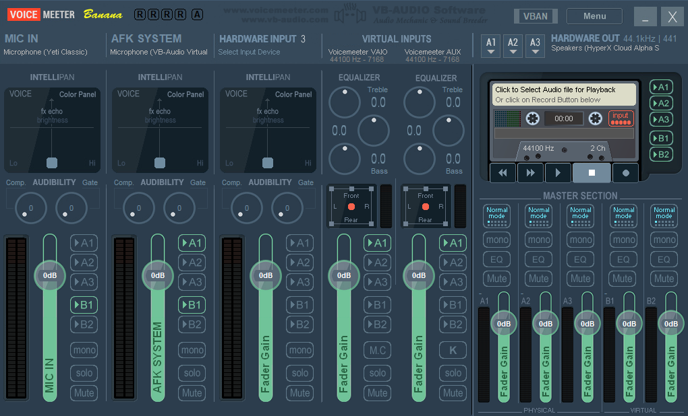

# Discord AFK System
A repeating SFX player to prevent Discord from kicking you out of calls.

### Consider supporting the creator!
[Patreon](https://www.patreon.com/c/antaptive) | [Kofi](https://ko-fi.com/antaptive) | [Merch Store](http://shop.antaptive.com)

Discord AFK System is not affiliated with Discord. 
Discord is owned by Discord Inc. No copyright infringement intended.

## Usage
1. Install [VB-Audio Virtual Audio Cable](https://vb-audio.com/Cable/) & [VoiceMeeter Banana](https://vb-audio.com/Voicemeeter/banana.htm)
    * VoiceMeeter Banana is only needed to use your mic and the AFK system simultaneously. It can also be used to hear the sound effects on your audio device. It is not necessary. Alternatively, you can choose to "Listen" to the virtual audio cable in your Windows sound settings.
    * VoiceMeeter Simple is not recommended since it doesn't have virtual inputs.
2. Restart your PC after installing
3. Set your Discord mic
    * **Using VoiceMeeter:** Set to **VoiceMeeter Output (VB-Audio VoiceMeeter VAIO)** or **VoiceMeeter Aux Output (VB-Audio VoiceMeeter AUX VAIO)** depending on your use case
    * **Not using VoiceMeeter:** Set to **Microphone (VB-Audio Virtual Cable)**
4. In Discord AFK System, Click "Browse" to choose an audio file
5. In the "Seconds" input, choose the repeating delay in seconds.

## Audio Crackling Fix
If other participants in the call report crackling from your mic, there is a possible fix built into Discord AFK System.

Click "Audio Crackling Fixer" to open a window to change `audiodg.exe`'s priority to High and affinity to only one processor on your PC. This should mitigate most lag. 
It is recommended that you pick a CPU you know is a physical core on your machine.

**NOTE:** `AudiodgElevator.exe` needs to be in the same directory as `Discord AFK System.exe` for this to work.

## VoiceMeeter Setup
This is my VoiceMeeter setup. If you have a more complex setup and need more inputs and outputs, check out [VoiceMeeter Potato](https://vb-audio.com/Voicemeeter/potato.htm).

**NOTE:** When selecting your audio devices, you will likely be given the option to choose between WDM or MME for your audio device. 
If you experience issues with using WDM, you may need to use MME. Experiment with it and see what works best for you.

Click the name of the audio device to change it. 
Right-click the name and press Enter after typing to rename the channel. (optional) 

### **Hardware Input 1:** Your microphone 
Output to **B1** to send to Discord.

### **Hardware Input 2:** Microphone (VB-Audio Virtual Cable) (This is the Discord AFK System) 
Output to **A1** so you can hear it. 
Output to **B1** to send to Discord.

### **Hardware Out 1/A1:** Your speakers/headphones

### Discord Input: VoiceMeeter Output (VB-Audio VoiceMeeter VAIO)
Use **VoiceMeeter Aux Output (VB-Audio VoiceMeeter AUX VAIO)** If you're outputting to **B2**.

